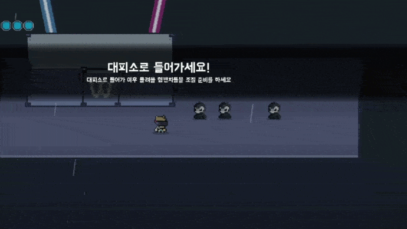

# Hyumpanchi-of-Woowakgood


왁굳형 조공용으로 처음 만든 팬게임

연공전에 제출 했는데, 혐그랑 방송도중에 트위치 서버가 맛이 가서 이것저것 여러개 겹쳐서 광탈함

### ▼ 미리보기


### ▼ 게임 트레일러

https://youtu.be/G-lGRxXmPog

#

### ▼ 게임 다운로드

https://youtu.be/G-lGRxXmPog


## - 코드 관련 설명글

### ▼ 실시간 트위치 채팅 연동
-------------



관련 알고리즘은 Script 폴더내의 이름이 twitch로 된 코드들을 확인해주세요

https://github.com/ABER1047/Hyumpanchi-of-Woowakgood/tree/master/scripts

#

### ▼ 레이저 (보스가 발사하던 레이저)
-------------

전체적인 알고리즘은 다음과 같습니다.
```
1. 최적화를 위해 레이저가 최대로 뻗어나갈 수 있는 거리에 제한을 둠 (아마 인게임에선 2500정도로 제한을 뒀음)

2. 레이저가 발사되는 지점 (x1,y1)을 기준으로 특정 발사 각도로 쭉 플레이어나 바닥에 닿거나 최대 거리로 뻗어나갈 때까지 반복문으로 체크

3. 플레이어나 바닥에 닿았거나, 최대 거리까지 뻗어나간 경우 반복문 빠져나오기

4. 반복문을 빠져나온 순간에서의 좌푯값 (x2,y2)까지 선을 이어줌 (해당 선이 레이저)
```
